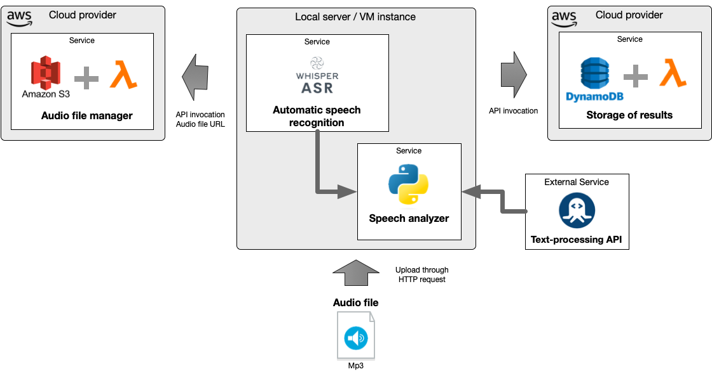

# A Speech analyzer integrating cloud services

This repository includes the source code for deploying a web service for uploading, transcribing and analyzing audio containing speech. The supported language is spanish. The Docker engine is required for deploying the web services.

This web service uses the following components:
- Whisper ASR is deployed as an API Rest within a Docker container
- The [Text-processing API](http://text-processing.com/docs/index.html) public API is used for phrase Extraction & Named Entity Recognition
- AWS S3 is used for storing audio files
- AWS Dynamo is the database for storing the results of the analysis
- A Flask application was developed for integrating all service and implementing the endpoints for uploading audios, listing results and querying a single result



For deploying the web services the following steps must be performed:

### 1. Clone the base repository

```bash
git clone https://github.com/ersigcha23/cloudc-speech-analyzer.git
```

### 2. Navigating to the cloned repo

```bash
cd cloudc-speech-analyzer
```

### 3. Building the Docker infrastructure

Prior to deploying the containers, it is required to include the credentials file to access S3 services, DynamoDB, and AWS Lambda functions.

The instructions of the required Roles, Lambda functions and DynamoDB Table are included in this [PDF file](https://github.com/ersigcha23/cloudc-speech-analyzer/blob/f48b275b44006d74d29c7720e0c89eb6174d02e0/InstruccionesAWS.pdf)

The credentials file should be located in the cloudc-speech-analyzer/speech-analyzer-webservice directory. The following command can be used to create the "credentials" file:

```
touch speech-analyzer-webservice/credentials
```

 The structure of the "credentials" file is as follows:

 ```yaml
[default]
aws_access_key_id = [YOUR AWS ACCESS KEY ID]
aws_secret_access_key = [YOUR AWS SECRET ACCESS KEY]

[Usuario1]
aws_access_key_id = [YOUR AWS ACCESS KEY ID]
aws_secret_access_key = [YOUR AWS SECRET ACCESS KEY]
```
 
This step is required since the Web application must be capable of creating objects and database records within an AWS account.

After creating the credentials file, the Docker containers can be started using:

```
docker compose build
```
```
docker compose up
```

After initiating the containers the following output will appear:

```console
...
proxy-1                   | 2024/03/09 22:11:42 [notice] 1#1: start worker process 37
webserver-1               | [2024-03-09 22:11:42 +0000] [1] [INFO] Starting gunicorn 21.2.0
webserver-1               | [2024-03-09 22:11:42 +0000] [1] [INFO] Listening at: http://0.0.0.0:5001 (1)
webserver-1               | [2024-03-09 22:11:42 +0000] [1] [INFO] Using worker: sync
webserver-1               | [2024-03-09 22:11:42 +0000] [7] [INFO] Booting worker with pid: 7
webserver-1               | [2024-03-09 22:11:42 +0000] [8] [INFO] Booting worker with pid: 8
whisper-asr-webservice-1  | [2024-03-09 22:11:42 +0000] [1] [INFO] Starting gunicorn 21.2.0
whisper-asr-webservice-1  | [2024-03-09 22:11:42 +0000] [1] [INFO] Listening at: http://0.0.0.0:9000 (1)
whisper-asr-webservice-1  | [2024-03-09 22:11:42 +0000] [1] [INFO] Using worker: uvicorn.workers.UvicornWorker
whisper-asr-webservice-1  | [2024-03-09 22:11:42 +0000] [7] [INFO] Booting worker with pid: 7
webserver-1               | [2024-03-09 22:11:42 +0000] [9] [INFO] Booting worker with pid: 9
whisper-asr-webservice-1  | [2024-03-09 22:11:44 +0000] [7] [INFO] Started server process [7]
whisper-asr-webservice-1  | [2024-03-09 22:11:44 +0000] [7] [INFO] Waiting for application startup.
whisper-asr-webservice-1  | [2024-03-09 22:11:44 +0000] [7] [INFO] Application startup complete.
```
In order to perform the following steps, you must open another Terminal window.

### 4. Supported endpoints

The following endpoits are available:

#### Uploading and Analyzing a MP3 Audio Speech

This endpoint transfer an audio file to the server to be analyzed and stored in an S3 Bucket.  

```bash
curl -X POST -F "file=@<Path-to-the-mp3-audio-file>" http://<SERVER_IP>/uploadFile
```

The response of the web service is similar to this output:

```console
{"analysisResult":{"LOC":["Bueno","Carla","Perfecto","Bueno"],"MISC":["tejana toscay"],"ORG":["audici\u00f3n","guion"],"PER":["mira","Carla","mira","Estamos","estoy enojada"]},"s3FileName":"qAtNC9mblo.mp3","status_transcription":" Bueno, conoc\u00eda uno de los productores, as\u00ed que le llamo. Carla, mira, lo que pasa es que estamos buscando alguien que pueda interpretar una tejana toscay y racista. Perfecto, yo puedo ver eso. Claro, Carla, mira, lo que pasa es que el director cree que eres muy bonita, muy delicada. Estamos buscando alguien que parezca a una droga dicta. Me cuelo. Bueno, estoy enojada y frustrada porque solo quer\u00eda tener la oportunidad de hacer la audici\u00f3n, pero ni es quiera eso. Me quieren dar as\u00ed que consigo el guion."}
```

#### Listing the results of the analysis stored in Dynamo

This endpoint returns a JSON list with the results of the previous audio files uploaded to the Server.

```bash
curl -X GET http://<SERVER_IP>/results
```

### Listing the results of the analysis stored in Dynamo

This endpoint returns the full details of one of audio files uploaded to the Server. The S3 FileName is required as parameter

```bash
curl -X GET http://<SERVER_IP>/results/<s3Filename_of_the_audiofile>
```

### Test the deployed service in the UCuenca Cloud Computing Server

The service is deployed on the University of Cuenca cloud computing server. In order to test the endpoints, you can execute the following commands, which will send requests to the server with IP 10.0.2.249:

You will need a VPN connection in order to test the endpoints. You can use the audio-test file:

```bash
curl -X POST -F "file=@<Path-to-the-mp3-audio-file>" http://10.0.2.149/uploadFile
```

```bash
curl -X GET http://10.0.2.149/results
```

```bash
curl -X GET http://10.0.2.149/results/<s3Filename_of_the_audiofile>
```

### 6 - Turning down the containers

Press Ctrl+C in the terminal where the containers are being executed.

```console
docker compose down
```

### References consulted for this tutorial

1. [Whisper ASR Webservice](https://github.com/ahmetoner/whisper-asr-webservice)

2. [Text-processing API](http://text-processing.com/docs/index.html)


